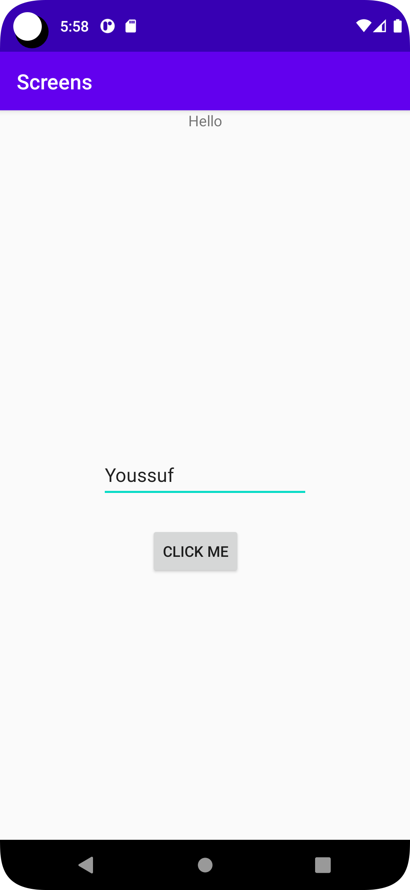
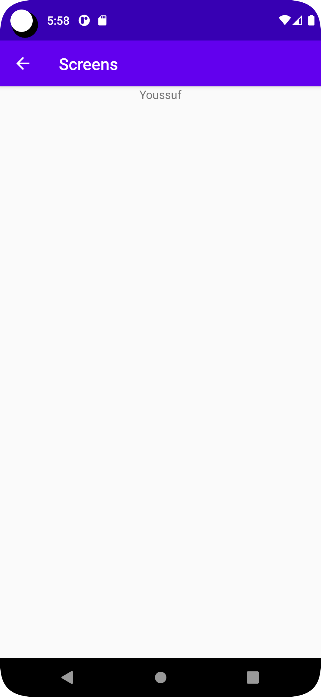

# Rapport

**Skriv din rapport här!**
Två activites lades till, en main och en view, samt tre widgets.
Ena widgeten Textview välkomnar användaren, den andra widgeten EditText tillåter användaren manipulera namnfältet, 
i MainActivity, till att presentera användarens namn som sedan skickas över till viewActivity. 
Slutligen lades en Button även till. 
MainActivity inehåller en intent som pekar mot ViewActivity.
I ViewActivity lades en textview till för att presentera datan från den föregående MainActivity, detta möjliggjordes via en intent.
En intent är ett objekt som möjliggör överföring av data mellan olika activities. 
Att återvända till MainActivity har gjorts enkelt då en klickbar pil förenklar processen.
Den här koden hämtar data från en intents extra bundle. Intenten skickas mellan activities och koden tittar också om det finns extras ihopsatta med intents.

```  Bundle extras = getIntent().getExtras();

        TextView newView =findViewById(R.id.textViewName);
        if (extras != null) {

            String name = extras.getString("name");
           // editTextName.setText(String.valueOf(newView));

            newView.setText(name);

 ```

## Följande grundsyn gäller dugga-svar:

- Ett kortfattat svar är att föredra. Svar som är längre än en sida text (skärmdumpar och programkod exkluderat) är onödigt långt.
- Svaret skall ha minst en snutt programkod.
- Svaret skall inkludera en kort övergripande förklarande text som redogör för vad respektive snutt programkod gör eller som svarar på annan teorifråga.
- Svaret skall ha minst en skärmdump. Skärmdumpar skall illustrera exekvering av relevant programkod. Eventuell text i skärmdumpar måste vara läsbar.
- I de fall detta efterfrågas, dela upp delar av ditt svar i för- och nackdelar. Dina för- respektive nackdelar skall vara i form av punktlistor med kortare stycken (3-4 meningar).

Programkod ska se ut som exemplet nedan. Koden måste vara korrekt indenterad då den blir lättare att läsa vilket gör det lättare att hitta syntaktiska fel.

```
function errorCallback(error) {
    switch(error.code) {
        case error.PERMISSION_DENIED:
            // Geolocation API stöds inte, gör något
            break;
        case error.POSITION_UNAVAILABLE:
            // Misslyckat positionsanrop, gör något
            break;
        case error.UNKNOWN_ERROR:
            // Okänt fel, gör något
            break;
    }
}
```

Bilder läggs i samma mapp som markdown-filen.



Läs gärna:

- Boulos, M.N.K., Warren, J., Gong, J. & Yue, P. (2010) Web GIS in practice VIII: HTML5 and the canvas element for interactive online mapping. International journal of health geographics 9, 14. Shin, Y. &
- Wunsche, B.C. (2013) A smartphone-based golf simulation exercise game for supporting arthritis patients. 2013 28th International Conference of Image and Vision Computing New Zealand (IVCNZ), IEEE, pp. 459–464.
- Wohlin, C., Runeson, P., Höst, M., Ohlsson, M.C., Regnell, B., Wesslén, A. (2012) Experimentation in Software Engineering, Berlin, Heidelberg: Springer Berlin Heidelberg.
